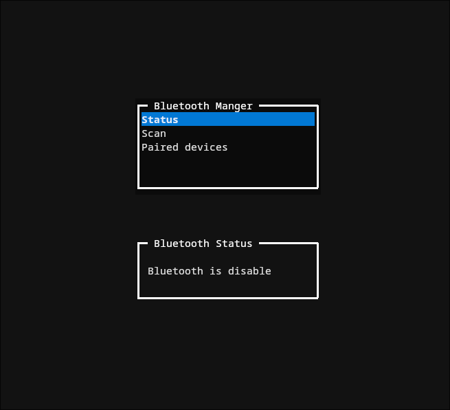
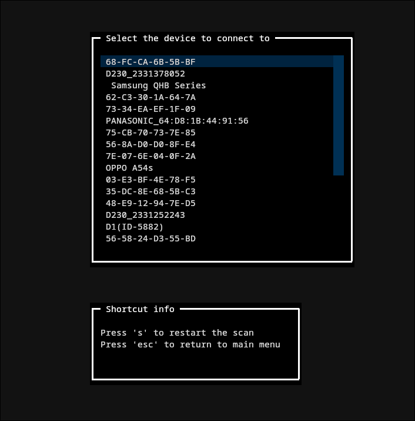

# Bluetooth TUI Manager

A text-based user interface (TUI) for managing Bluetooth connections on Linux, built with Python and Textual.

## Table of Contents

- [Description](#description)
- [Screenshot](#screenshot)
- [Features](#features)
- [Requirements](#requirements)
- [Installation](#installation)
- [Usage](#usage)
- [Troubleshooting](#troubleshooting)

---

## Description

Bluetooth TUI Manager is a terminal application that provides an intuitive interface to manage Bluetooth devices through `bluetoothctl`. It allows you to control Bluetooth status, scan for available devices, manage paired devices, and establish connections in a simple and fast way.

---

##Screenshot



---

## Features

- **Bluetooth Status Control**: Display current Bluetooth status (enabled/disabled/connected)
- **Enable/Disable**: Turn Bluetooth on or off with a simple command
- **Device Scanning**: Search for nearby available Bluetooth devices
- **Device Connection**: Quickly connect to found devices
- **Paired Device Management**: View, connect, or remove already paired devices
- **Intuitive Interface**: Simple navigation with keyboard shortcuts

---

## Requirements

- Python 3+
- Linux with `bluetoothctl` installed
- Textual library

---

## Installation

1. Install dependencies:
```bash
pip install textual
```

2. Ensure `bluetoothctl` is installed on your system

3. Clone the repository:
```bash
git clone https://github.com/ViTo114/BluetoothManger-TUI.git
cd BluetoothManger-TUI
```

---

## Usage

Start the application with:

```bash
python BluetoothManager.py
```

---

## Troubleshooting

### No devices found during scan
Check that:
- Devices to connect are in pairing mode
- There are no conflicts with other Bluetooth applications
- Try disabling and re-enabling Bluetooth

---

⭐ If this project was helpful to you, leave a star on GitHub!
